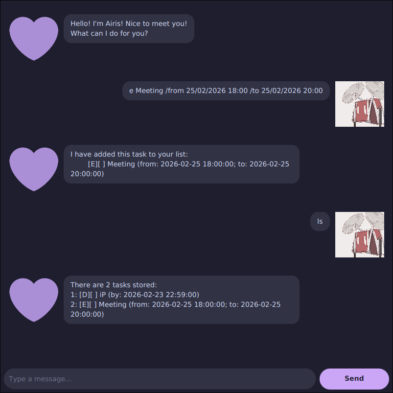

<!-- Entire user guide is generated by AI tools (Claude). -->

# Airis User Guide



Airis is a personal task manager chatbot that helps you keep track of todos, deadlines, and events. It stores your tasks locally and remembers them between sessions.

---

## Quick Start

1. Ensure you have **JDK 17** installed.
2. Download the latest `airis.jar` from the releases page.
3. Run it with:
   ```
   java -jar airis.jar
   ```

To build from source using Gradle:
```
./gradlew run
```

---

## Date & Time Formats

Wherever a date/time is required, Airis accepts any of the following formats:

| Format | Example |
|--------|---------|
| `yyyy-MM-dd HH:mm:ss` | `2025-03-15 14:30:00` |
| `dd/MM/yyyy HH:mm` | `15/03/2025 14:30` |
| ISO local date-time | `2025-03-15T14:30:00` |

---

## Commands

### Add a Todo — `todo`

Adds a simple task with no date attached.

**Syntax:** `todo DESCRIPTION`

**Alias:** `t`

**Example:**
```
todo Buy groceries
```

**Output:**
```
I have added this task to your list:
    [T][ ] Buy groceries
```

---

### Add a Deadline — `deadline`

Adds a task with a due date.

**Syntax:** `deadline DESCRIPTION /by DATE_TIME`

**Alias:** `d`

**Example:**
```
deadline Submit assignment /by 2025-04-01 23:59:00
```

**Output:**
```
I have added this task to your list:
    [D][ ] Submit assignment (by: 2025-04-01 23:59:00)
```

---

### Add an Event — `event`

Adds a task with a start and end time.

**Syntax:** `event DESCRIPTION /from DATE_TIME /to DATE_TIME`

**Alias:** `e`

**Example:**
```
event Team meeting /from 2025-04-01 10:00:00 /to 2025-04-01 11:00:00
```

**Output:**
```
I have added this task to your list:
    [E][ ] Team meeting (from: 2025-04-01 10:00:00; to: 2025-04-01 11:00:00)
```

---

### List All Tasks — `list`

Displays all tasks currently in your list.

**Syntax:** `list`

**Alias:** `ls`

**Example:**
```
list
```

**Output:**
```
There are 3 tasks stored:
1. [T][ ] Buy groceries
2. [D][ ] Submit assignment (by: 2025-04-01 23:59:00)
3. [E][ ] Team meeting (from: 2025-04-01 10:00:00; to: 2025-04-01 11:00:00)
```

---

### Mark a Task as Done — `mark`

Marks a task as completed using its list index.

**Syntax:** `mark INDEX`

**Alias:** `x`

**Example:**
```
mark 1
```

**Output:**
```
I've mark this as done:
    [T][X] Buy groceries
```

---

### Unmark a Task — `unmark`

Marks a previously completed task as not done.

**Syntax:** `unmark INDEX`

**Alias:** `ux`

**Example:**
```
unmark 1
```

**Output:**
```
I've mark this as not done yet:
    [T][ ] Buy groceries
```

---

### Delete a Task — `delete`

Removes a task from the list using its index.

**Syntax:** `delete INDEX`

**Alias:** `del`

**Example:**
```
delete 2
```

**Output:**
```
I've deleted this task:
    [D][ ] Submit assignment (by: 2025-04-01 23:59:00)
```

---

### Find Tasks — `find`

Searches for tasks whose descriptions contain the given keyword.

**Syntax:** `find KEYWORD`

**Alias:** `f`

**Example:**
```
find meeting
```

**Output:**
```
There are 1 matches:
[E][ ] Team meeting (from: 2025-04-01 10:00:00; to: 2025-04-01 11:00:00)
```

---

### Exit — `bye`

Exits the application.

**Syntax:** `bye`

**Alias:** `q`

---

## Data Storage

Tasks are saved automatically to `data.txt` in the working directory after every change. The file is created on first run if it does not exist. You do not need to save manually.
